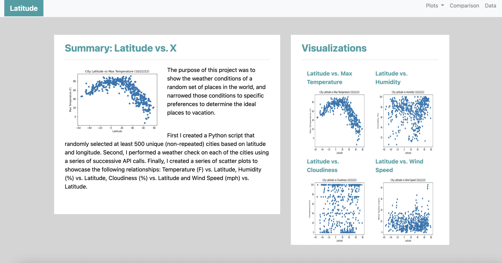
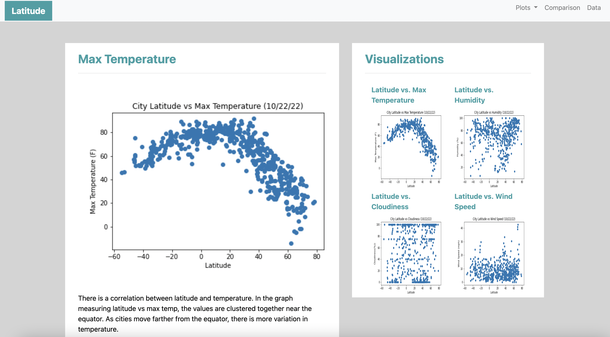
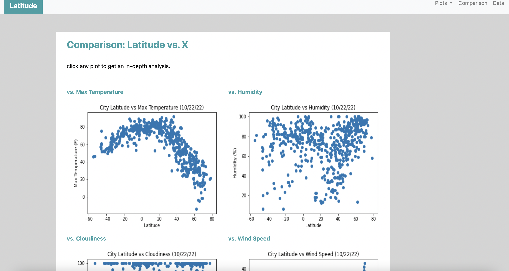
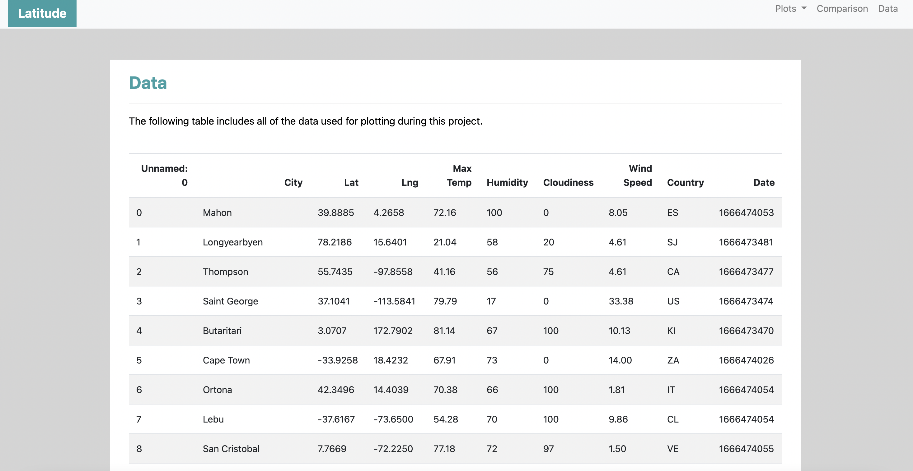

## Ideal Vacation Spots Web Design 

Website Visualization of Ideal Vacation Spots API Project

### Dataset:

 [Ideal Vacation Spots API Project](https://github.com/bmilne64/python-api-challenge)

## Objectives

### Step 1 - Landing Page

* Create a landing page that contains an explanation of the project and a link to each visualization page within a sidebar containing a preview image of each visualization

### Step 2 - Visualization Pages 

* Create four visualization pages each with a descriptive title, the visualization for the selected comparison and a paragraph describing the visualization and its significance

### Step 3 - Comparisons Page 

*  Create a comparisons page that contains all the visualizations on the same page and uses a Bootstrap grid for the visualizations so that people can easily compare them 

### Step 4 - Data Page 

* Create a data page that displays a table containing the data that the visualizations use

---------------------------------------------------

<b>Contact:</b> bronwynmilne64@gmail.com
